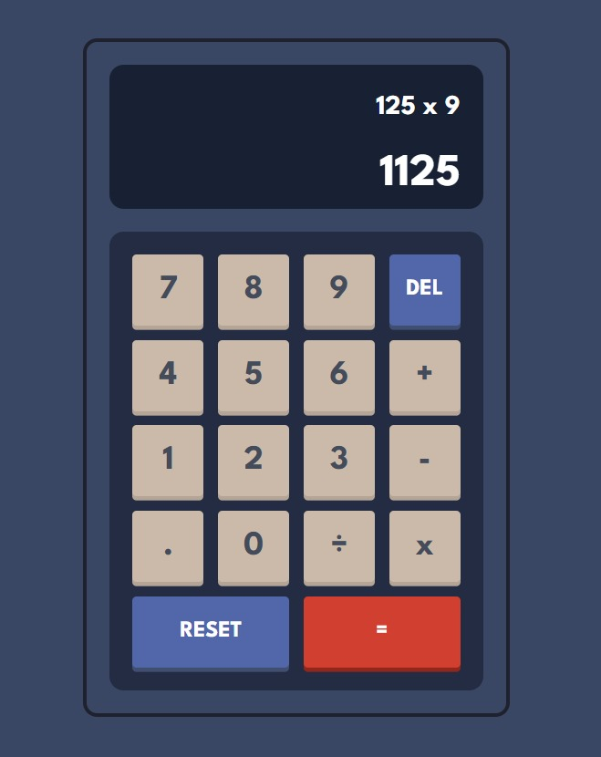

# Calculator app

Simple calculator created with HTML, CSS and Vanilla Javascript.

Calculator contains functions for all of the basic math operators such as :

- add
- subtract
- multiply
- divide

## Live-preview

- [Live-Site](https://lucent-tulumba-2f51d4.netlify.app/)
